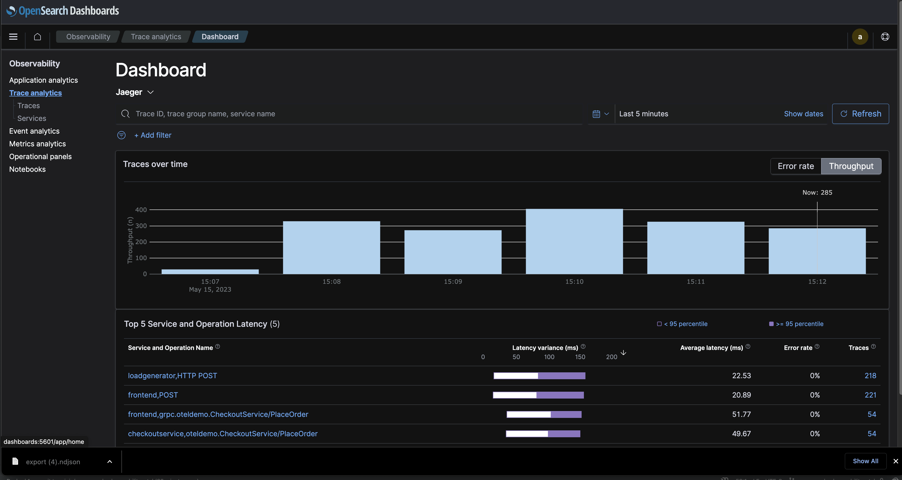

# Observability

### OpenSearch Dashboards

Observability is collection of plugins and applications that let you visualize data-driven events by using Piped Processing Language to explore, discover, and query data stored in OpenSearch.
Your experience of exploring data might differ, but if you’re new to exploring data to create visualizations, we recommend trying a workflow like the following:

1. Explore data within a certain timeframe using [Piped Processing Language](https://opensearch.org/docs/latest/search-plugins/sql/ppl/index).

2. Use [event analytics](https://opensearch.org/docs/latest/observing-your-data/event-analytics) to turn data-driven events into visualizations.

3. Create [operational panels](https://opensearch.org/docs/latest/observing-your-data/operational-panels) and add visualizations to compare data the way you like.

4. Use [log analytics](https://opensearch.org/docs/latest/observing-your-data/event-analytics/) to transform unstructured log data.

5. Use [trace analytics](https://opensearch.org/docs/latest/observing-your-data/trace/index) to create traces and dive deep into your data.

6. Leverage [notebooks](https://opensearch.org/docs/latest/observing-your-data/notebooks) to combine different visualizations and code blocks that you can share with team members.

---
7. OpenSearch OpenTelemetry [Demo Store Application](https://opentelemetry.io/ecosystem/demo/) hosted in our [Observability Demo playground](https://playground.opensearch.org/)

- **_Demo Shop_**

- _**Trace Analytics**_

- **_Service Graph_**

